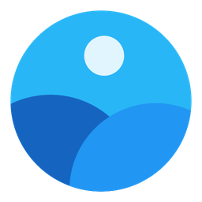
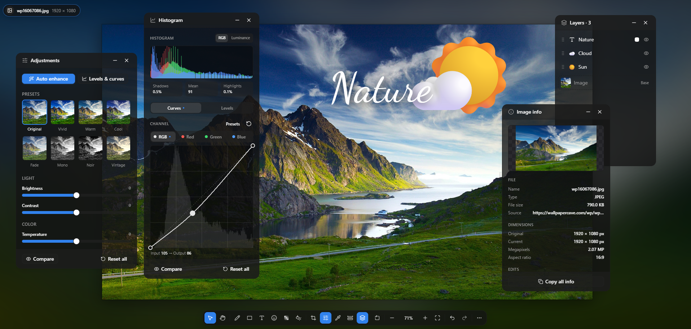
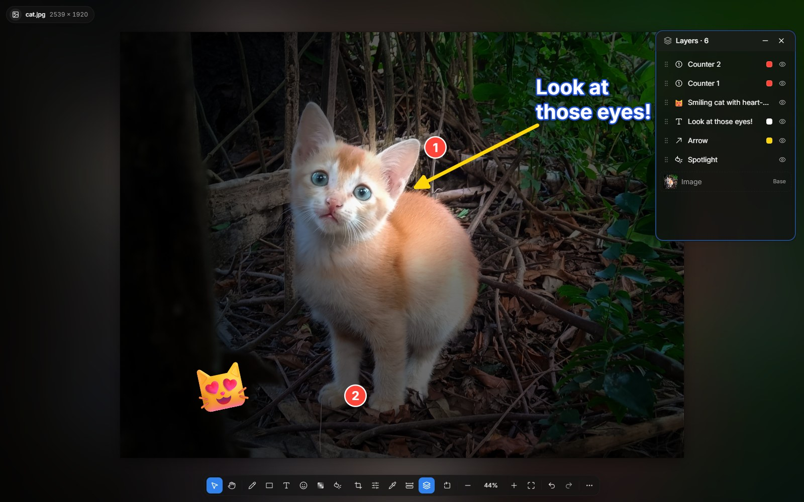
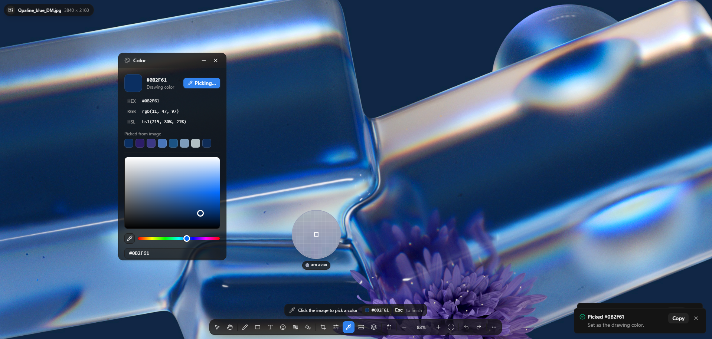
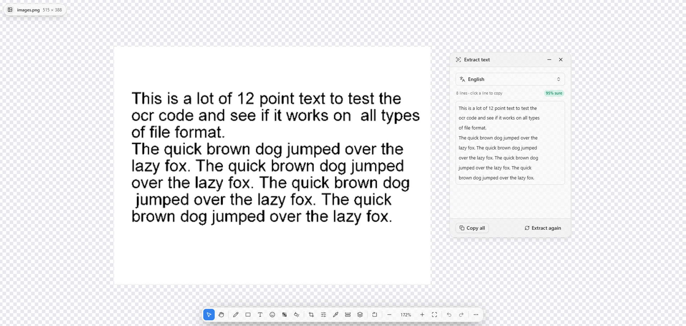
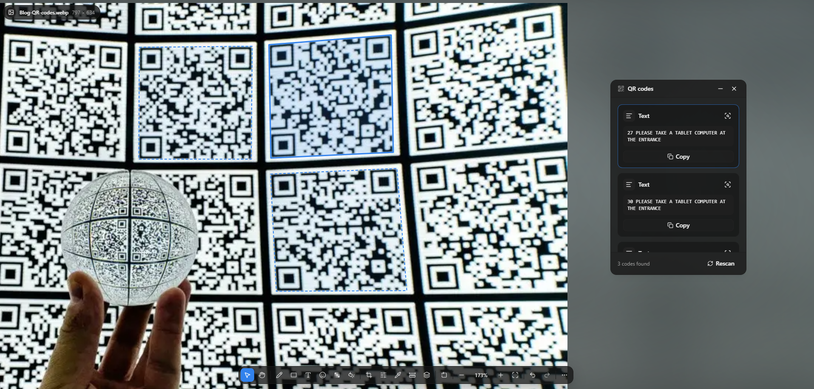
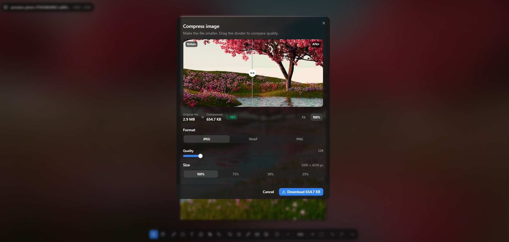
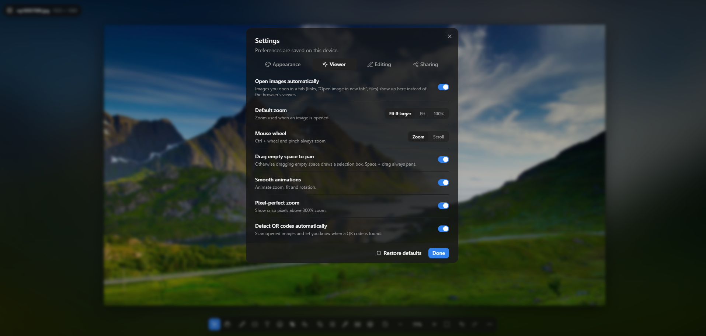

<h1 align="center">
    
    <br>
    BetterViewer
</h1>

<div align="center">
    
    
    
</div>

<h3 align="center">
    Fast, Simple, Easy image viewer.
</h3>

<p align="center">BetterViewer makes image viewing faster, easier, and more fun.</p>

<p align="center">BetterViewer was designed as a replacement for the image viewing mode built into Firefox & Chrome-based web browsers.</p>

<p align="center">With BetterViewer you can use various keyboard shortcuts to quickly pan, zoom, annotate, edit images and a lot more!</p>

<p align="center">
   <a href="https://chrome.google.com/webstore/detail/betterviewer/llcpfkbjgkpmapiidpnohffjmmnhpmpb"></a>
   <a href="https://microsoftedge.microsoft.com/addons/detail/betterviewer/jfladbainajdjpmdjpgndbgmkgibeddg"></a>
   <a href="https://addons.mozilla.org/en-US/firefox/addon/betterviewer"></a>
</p>

<p align="center">
    <a href="https://www.producthunt.com/posts/betterviewer?utm_source=badge-featured&utm_medium=badge&utm_souce=badge-betterviewer" target="_blank"></a>
</p>

<h3 align="center">
   Screenshots
</h3>

<h1 align="center">
    
</h1>

<h1 align="center">
    
</h1>

<h1 align="center">
    
</h1>

<h1 align="center">
    
</h1>

<h1 align="center">
    
</h1>

<h1 align="center">
    
</h1>

<h1 align="center">
    
</h1>

### Features

Open any image in a new tab and BetterViewer takes over. Everything runs in
your browser, including OCR, background removal and QR scanning.

**Viewing**

- Smooth zoom (wheel, pinch, **+ / −**), fit / 100% / zoom to selection, pan
  (drag, **Space**, scrollbars), crisp pixels when zoomed in close
- Board background: blurred image, black, white or transparency grid
- Rotate left / right, flip horizontal / vertical
- Image info with full **EXIF** (camera, exposure, GPS with map link); copy a
  line or everything
- **Measure** distances and angles, **rulers** and draggable **guides**
- Dark / light / system theme, floating panels, quick launch (**Ctrl/⌘ K**)

**Editing**

- **Crop** with aspect presets, **straighten** (level line) and **perspective**
  correction, **resize**
- **Adjustments**: brightness, contrast, temperature, tint, vibrance,
  saturation, hue, sharpen, noise reduction, blur, vignette, grayscale, sepia,
  invert, 8 presets and one-click **Auto enhance**
- **Levels**, **curves** (RGB / R / G / B) and a live **histogram**
- **Remove background** (AI, on your device)
- Hold **Compare** to see the original; full **undo / redo**

**Annotating**

- Pen, highlighter and eraser; 31 shapes (arrows, callouts, stars…) and
  numbered **counters**
- **Text** with 44 fonts, background, **outline** and **shadow**
- **Emoji** picker (search, categories, skin tones)
- **Blur / pixelate** zones to hide faces, plates or text
- **Spotlight**: dim everything except what matters
- Insert images on top, **Layers** panel (reorder, hide, delete)
- Color picker with loupe (HEX / RGB / HSL), snap to grid

**Tools & sharing**

- **Extract text (OCR)** in 13 languages
- **QR code scanner** (links, Wi-Fi, contacts, events…)
- **Compress** with a quality slider and before / after size
- **Export** PNG / JPEG / WebP, copy to clipboard
- **Upload** to kappa.lol or ImgBB, **Open in Photopea**, **Search on TinEye**

### Keyboard shortcuts

| Tools               |               | View                |                   | Edit & file       |                       |
| ------------------- | ------------- | ------------------- | ----------------- | ----------------- | --------------------- |
| Select              | V             | Zoom in / out       | Ctrl + / −        | Undo / redo       | Ctrl Z / Ctrl Shift Z |
| Pan                 | H, hold Space | Fit / 100%          | 0 / 1             | Delete            | Del                   |
| Pen / highlighter   | P / Shift P   | Zoom to selection   | 2                 | Duplicate         | Ctrl D                |
| Eraser              | E             | Rotate right / left | R / Shift R       | Select all        | Ctrl A                |
| Rectangle / ellipse | S / O         | Flip H / V          | Shift H / Shift V | Nudge             | Arrows (Shift ×10)    |
| Line / arrow        | L / A         | Resize image        | Ctrl Alt I        | Front / back      | ] / [                 |
| Counter             | N             | Toggle interface    | Tab               | Quick launch      | Ctrl K                |
| Blur / pixelate     | M             | Rulers & guides     | Shift U           | Open / paste      | Ctrl O / Ctrl V       |
| Text                | T             |                     |                   | Save / copy       | Ctrl S / Ctrl Shift C |
| Color picker        | I             |                     |                   | Settings          | Ctrl ,                |
| Crop                | C             |                     |                   | Shortcuts list    | ?                     |
| Adjustments         | F             |                     |                   | Cancel / deselect | Esc                   |
| Levels & curves     | Shift C       |                     |                   |                   |                       |
| Layers              | Shift L       |                     |                   |                   |                       |
| Scan QR codes       | Q             |                     |                   |                   |                       |
| Spotlight           | G             |                     |                   |                   |                       |
| Measure             | U             |                     |                   |                   |                       |

(**⌘** instead of Ctrl on macOS)

### Privacy

Images are processed on your device: adjustments, OCR, background removal,
QR scanning and EXIF reading never upload them. Only **Upload image**, **Open in
Photopea** and **Search on TinEye** send an image to a third-party service, and
only when you choose them. OCR language data, the background-removal model and
web fonts are downloaded once, on first use. Exports never include the
original's EXIF / GPS data.

### Build from source

```bash
npm install
npm run dev        # web app at http://localhost:5173
npm run build      # web app → dist/
npm run build:ext  # extension → build/chrome, build/firefox (+ store .zip files)
```

- **Chrome / Edge / Brave / Opera**: open `chrome://extensions`, turn on
  **Developer mode**, click **Load unpacked** and pick `build/chrome`. For
  images on your computer (`file://`), open the extension's **Details** and
  enable **Allow access to file URLs**.
- **Firefox (140+)**: open `about:debugging#/runtime/this-firefox`, click
  **Load Temporary Add-on…** and pick `build/firefox/manifest.json`.

Turn the automatic takeover off in **Settings → Viewer → Open images
automatically**; **More → View original** shows the browser's
own viewer for an image.

**Stack:** React 19 · TypeScript · Vite · Tailwind CSS v4 ·
[Shark UI](https://shark-ui.com/docs) (Ark UI) · Konva · Zustand ·
Tesseract.js · Transformers.js · exif-js · @nuintun/qrcode. Manifest V3; the
Chromium build uses a service worker, the Firefox build an event page;
everything else is shared (`extension/`, `scripts/build-extension.mjs`).

<details>
<summary><b>Project structure</b></summary>

```text
src/
  components/
    ui/        Shark UI components (registry source, a few small fixes)
    viewer/    ImageViewer, ViewerCanvas (Konva stage), ImageNode, annotation
               nodes, overlays (measure, rulers, spotlight), toolbar, info bar
    tools/     crop, straighten, draw, shapes, text, emoji, blur, spotlight,
               measure, adjustments, color picker, OCR, QR…
    panels/    floating panels and dialogs (settings, layers, histogram,
               command palette, upload, compress, resize, about…)
  hooks/       canvas interactions, keyboard shortcuts, image loading
  state/       document (undoable history), ui, settings, measure, draft
  lib/         viewport, actions, develop pipeline (+ worker), straighten warp
               (+ worker), background removal (+ worker), OCR, QR (+ worker),
               mipmaps, uploads, platform (web vs. extension), openUrl…
extension/     content.js, background.js, icons
scripts/       build-extension.mjs (manifests + zips), build-emoji-data.mjs
```

</details>

For ImgBB uploads, enter an API key in **Settings → Sharing** (kappa.lol needs
none). For local development you can also set `VITE_IMGBB_API_KEY` in
`.env.local` (see `.env.example`). Anything prefixed `VITE_` ends up in the
bundle, so don't ship a build with a private key.

# Changelog

## [3.0.0] - 2026-09-28

- BetterViewer 3: rebuilt from scratch (React 19, Vite, Tailwind CSS v4, Konva)
  as a Manifest V3 extension for Chrome, Edge and Firefox.
- All V1 features are back, and many new ones:
  - Infinite canvas with smooth zoom, rulers, guides and a measure tool.
  - Adjustments with auto enhance, white balance, vibrance, sharpen, noise
    reduction and vignette; levels, curves and a live histogram.
  - Crop, straighten, perspective correction and resize.
  - Annotations: shapes, arrows, counters, text with outline & shadow, emoji,
    blur / pixelate zones, spotlight, inserted images and a Layers panel.
  - AI background removal and OCR in 13 languages, on your device.
  - QR code scanner, compression, full EXIF info, color picker.
  - Upload to kappa.lol / ImgBB, Open in Photopea, Search on TinEye.
  - Quick launch (Ctrl/⌘ K), undo / redo, dark & light themes.
- Works offline: OCR and background-removal engines are bundled.

## [2.0.2] - 2025-03-19

- Add "Open image in new tab".
- Bug fixes.

## [2.0.1] - 2025-03-11

- New Annotation Tool – Draw and mark up images easily!
- Bug fixes and code cleanup.

## [2.0.0] - 2025-03-09

- New version of BetterViewer is here!
- Completely rewritten from scratch (React, TypeScript, [Plasmo](https://www.plasmo.com/))
- Using Manifest V3 (I had to remove some features because of this change, but I will add them back soon)
- Better UI/UX

## [1.0.5] - 2022-09-14

- Add "Zoom Ratio" option to Settings. (Thanks to @Metacor)

## [1.0.4] - 2022-04-19

- Add New Photo Editor [Filerobot Image Editor](https://scaleflex.github.io/filerobot-image-editor/) (Adjust, Draw, Watermark, Filters, Finetune, Resize, Export As PNG, JPEG, JPG, WEBP)
- Fix a bug where Chrome/Edge adds a duplicate image (Thanks to @patrykdziurkowski)
- Remove Photo Editor [Painterro](https://github.com/devforth/painterro)

## [1.0.3] - 2022-02-10

- Fix major bugs (Cropping issues, Going back issues, etc...)
- Add [Firefox](https://addons.mozilla.org/en-US/firefox/addon/betterviewer) Compatibility
- Fix Cropping issues
- Zoom In / Zoom Out is now smoother
- Fix some UI issues
- Add new settings
- Add "Default theme" setting
- Add "Toolbar position" setting
- Add "Notification toolbar" setting
- Add "Show/Hide all tools at the start" setting

## [1.0.2] - 2021-11-28

- Fix minor bugs
- Add "Reverse Image Search"
- Add "QR Code Scanner"
- Add Settings window
- Fix Shortcuts (Combo keys / Ctrl + Key)

## [1.0.1] - 2021-11-20

- Fix Crop problem
- Fix random shutdown
- Replace Imgur with ImgBB (Many users requested this)
- Add "Edit with Photopea"
- Add Contributors in About popup
- Edit in Photopea (Thanks to @bbbenji)

## [1.0.0] - 2021-11-10

- First version

## License

[MIT](./LICENSE) © Adem Kouki
